# Instalación On-Premises — Plataforma IAM con Keycloak
 
## Índice
 
1. [Introducción](#1-introducción)
2. [Arquitectura de la solución](#3-arquitectura-de-la-solución)
3. [Preparación del servidor](#4-preparación-del-servidor)
4. [Instalación de herramientas](#5-instalación-de-herramientas)
5. [Despliegue de la infraestructura](#6-despliegue-de-la-infraestructura)
6. [Configuración de Keycloak](#7-configuración-de-keycloak)
7. [Despliegue de las aplicaciones](#8-despliegue-de-las-aplicaciones)
8. [Verificación del RBAC](#9-verificación-del-rbac)
9. [Autenticación multifactor (MFA/TOTP)](#10-autenticación-multifactor-mfatotp)
10. [Federación de identidades con GitHub](#11-federación-de-identidades-con-github)
11. [Auditoría de eventos](#12-auditoría-de-eventos)
12. [Automatización de gestión de usuarios](#13-automatización-de-gestión-de-usuarios)
---
 
## 1. Introducción
 
Este documento describe el proceso de instalación y configuración de una plataforma de gestión de identidades y accesos (IAM) en un entorno on-premises. La solución utiliza **Keycloak** como proveedor de identidades centralizado, integrado con tres aplicaciones web que implementan **Single Sign-On (SSO)**, **control de acceso basado en roles (RBAC)**, **autenticación multifactor (MFA)** y **federación de identidades**.
 
Todo el entorno se ejecuta sobre contenedores Docker en una máquina virtual con Ubuntu Server 22.04 LTS.
 
---
 
## 2. Arquitectura de la solución
 
La plataforma se compone de cinco contenedores Docker conectados a través de una red interna:
 
| Contenedor | Puerto | Función |
|---|---|---|
| `iam-keycloak` | 8080 | Proveedor de identidades (IdP) |
| `iam-postgres` | 5432 (interno) | Base de datos de Keycloak |
| `iam-portal` | 5000 | Portal del empleado (rol: todos) |
| `iam-tickets` | 5001 | Sistema de tickets (rol: soporte, admin) |
| `iam-admin` | 5002 | Panel de administración (rol: admin) |
 
**Flujo de autenticación (OIDC Authorization Code Flow):**
 
1. El usuario accede a una aplicación.
2. La aplicación redirige al login de Keycloak.
3. El usuario se autentica (contraseña + TOTP si MFA está activo).
4. Keycloak genera un código de autorización.
5. La aplicación intercambia el código por un token JWT a través de la red interna.
6. La aplicación extrae los roles del token y aplica el RBAC.
---
 
## 3. Preparación del servidor
 
Desplegamos la máquina virtual con Ubuntu Server y actualizamos los repositorios:
 
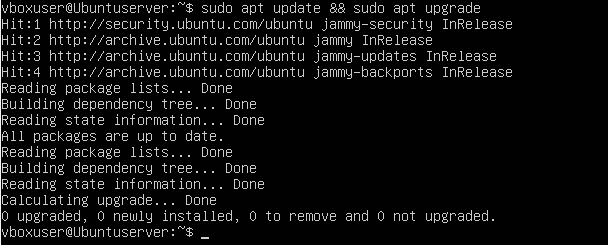
 
Nos conectamos por SSH desde el equipo principal para mayor comodidad:
 
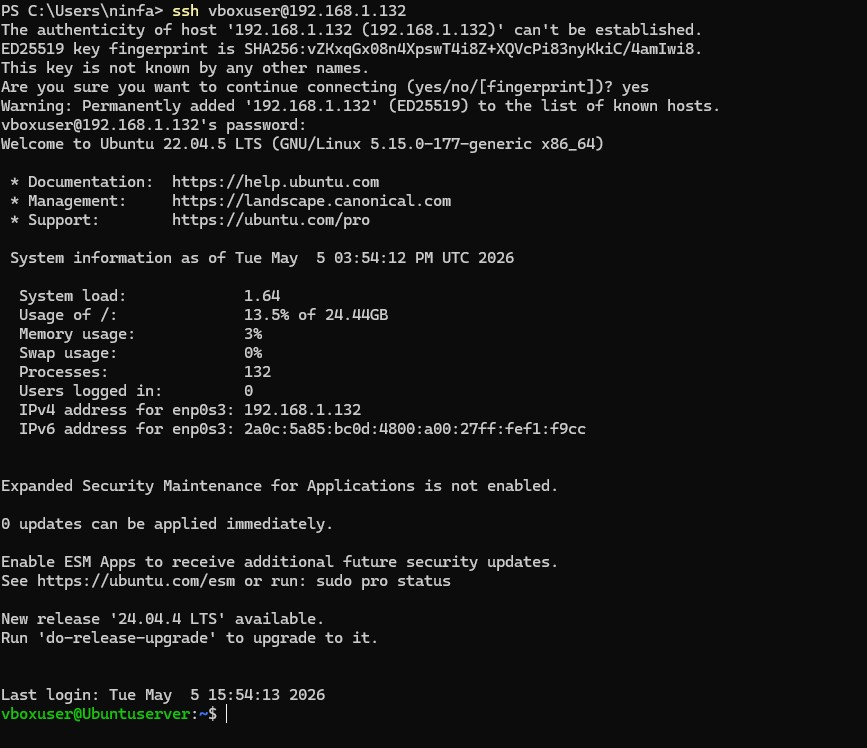
 
> **Nota:** Para instalar SSH en la VM: `sudo apt install -y openssh-server`
 
---
 
## 4. Instalación de herramientas
 
### 4.1 Docker y Docker Compose
 
Instalamos Docker y Docker Compose desde el repositorio oficial:
 
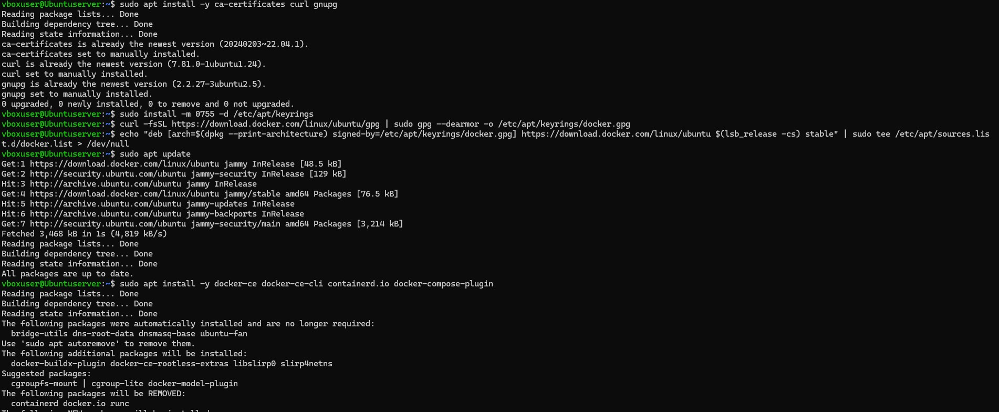
 
Añadimos nuestro usuario al grupo `docker` para poder ejecutar comandos sin `sudo`:
 

 
> **Importante:** Es necesario cerrar sesión y volver a entrar para que el cambio de grupo surta efecto.
 
### 4.2 Git y Python
 
Instalamos Git, pip y la librería `requests` que necesitaremos para los scripts de automatización:
 
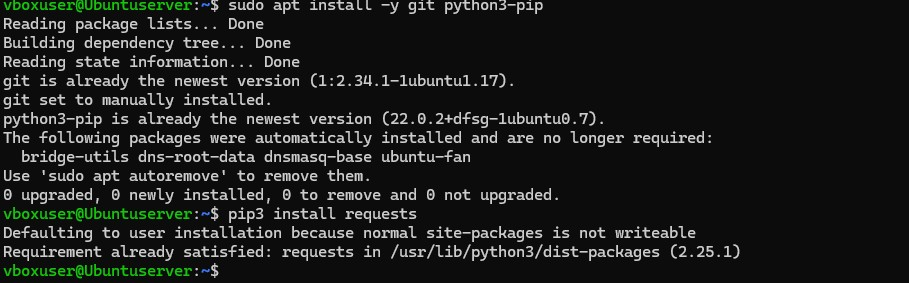
 
### 4.3 Verificación
 
Comprobamos que todas las herramientas están instaladas correctamente:
 
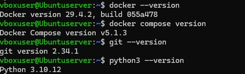
 
> **Nota:** No olvidar habilitar e iniciar Docker con `systemctl enable docker` y `systemctl start docker`.
 
---
 
## 5. Despliegue de la infraestructura
 
### 5.1 Estructura del proyecto y Docker Compose
 
Creamos la estructura de directorios y el archivo `docker-compose.yml` ([disponible en el repositorio](docker-compose.yml)):
 
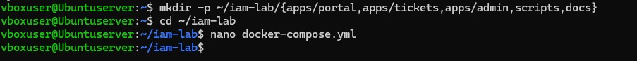
 
El `docker-compose.yml` define todos los servicios necesarios: PostgreSQL como base de datos, Keycloak como IdP, y las tres aplicaciones Flask. Todos los servicios se conectan a una red bridge interna (`iam-network`), se exponen los puertos necesarios al exterior y se configuran para reiniciarse automáticamente en caso de fallo.
 
### 5.2 Levantar los contenedores
 
Lanzamos todos los servicios con un solo comando:
 
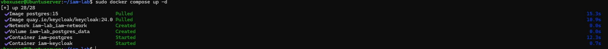
 
### 5.3 Verificación
 
Comprobamos que todos los contenedores están corriendo. Keycloak debe estar accesible en el puerto 8080:
 
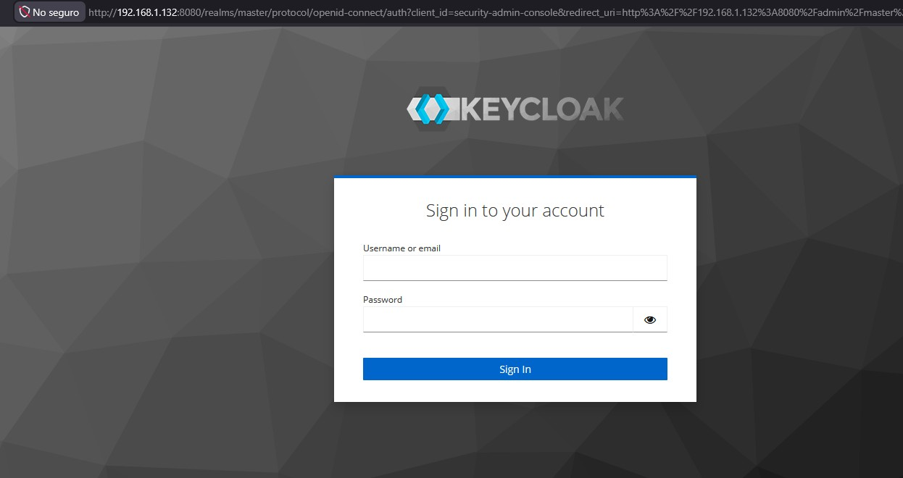
 
---
 
## 6. Configuración de Keycloak
 
### 6.1 Crear el Realm
 
Accedemos a la consola de administración de Keycloak (`http://IP_VM:8080`) con las credenciales de admin. Creamos un realm separado del master para nuestra organización:
 
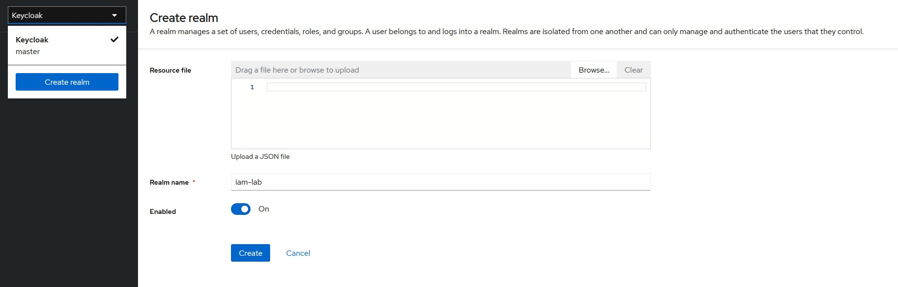
 
> **Buenas prácticas:** Nunca usar el realm `master` para aplicaciones. Siempre crear un realm dedicado.
 
### 6.2 Crear los roles
 
Dentro del realm, creamos los tres roles que definirán los niveles de acceso: `admin`, `soporte` y `empleado`.
 
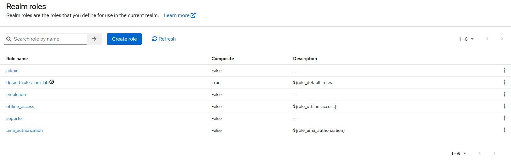
 
> ** Importante:** No borrar los roles por defecto de Keycloak (`default-roles-iam-lab`, `offline_access`, `uma_authorization`). Son necesarios para el funcionamiento interno.
 
### 6.3 Crear usuarios de prueba
 
Creamos los usuarios de prueba asignándoles sus respectivos roles. Para cada usuario:
1. Crear el usuario con sus datos.
2. Establecer una contraseña en la pestaña **Credentials** (con **Temporary** en OFF para el laboratorio).
3. Asignar el rol correspondiente en **Role mapping**.
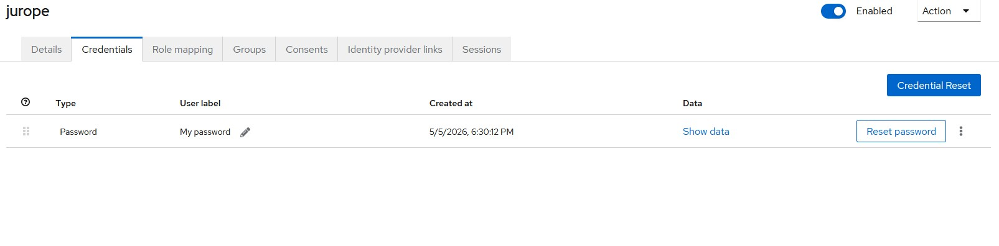
 
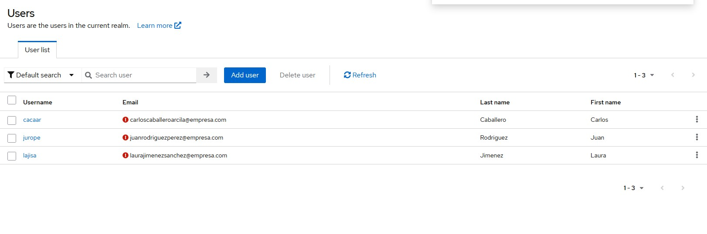
 
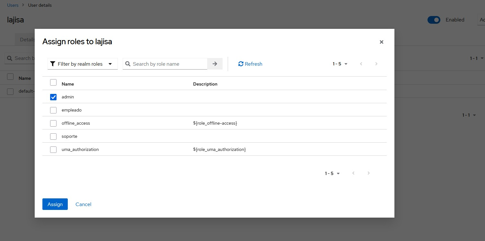
 
### 6.4 Crear los clientes (aplicaciones)
 
En Keycloak, un **cliente** es cualquier aplicación que quiere usar Keycloak para autenticar usuarios. Creamos un cliente por cada aplicación con **Client authentication** activado (cliente confidencial) y protocolo **OpenID Connect**:
 
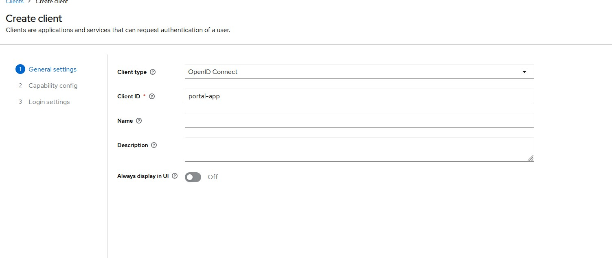
 
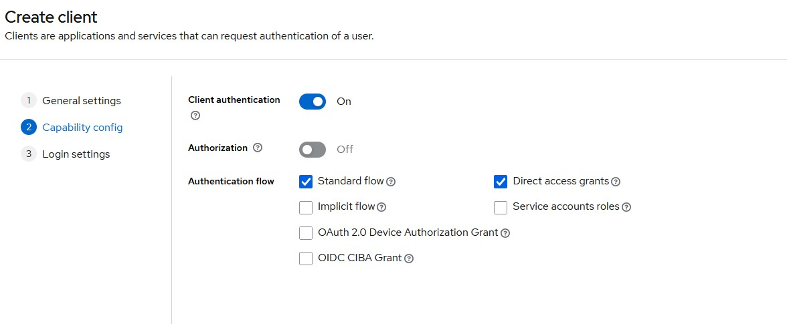
 
Configuramos las **Valid Redirect URIs** y **Web Origins** con la IP de la VM y el puerto correspondiente:
 
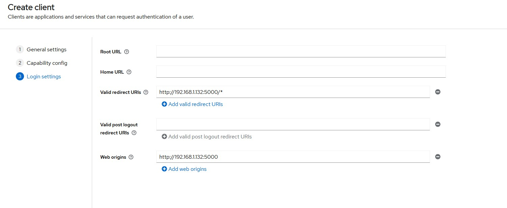
 
### 6.5 Client Secret
 
Cada cliente confidencial recibe un **Client Secret** único. Este secret es necesario para que la aplicación pueda intercambiar códigos de autorización por tokens JWT.
 
Copiamos el secret de cada cliente desde la pestaña **Credentials** y lo introducimos en el `app.py` correspondiente:
 
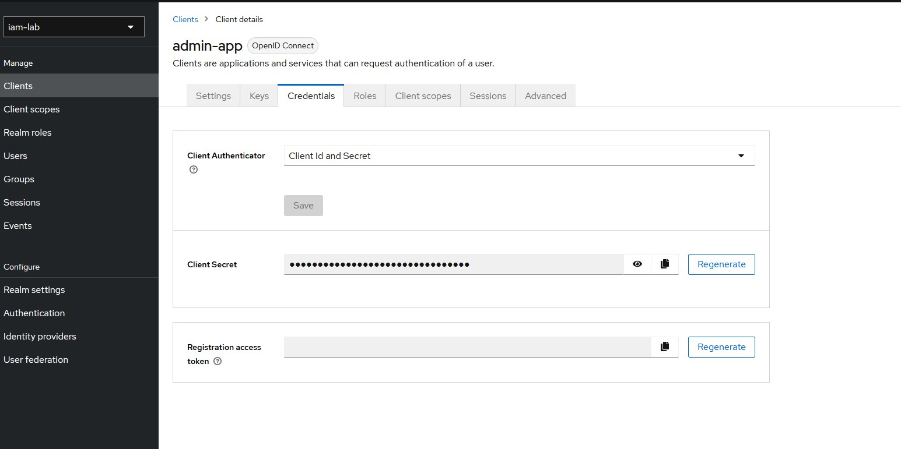
 
> **¿Cómo funciona?** Cuando un usuario inicia sesión, Keycloak devuelve un código de autorización a la aplicación. La aplicación envía este código junto con su Client ID y Client Secret al endpoint de tokens de Keycloak. Keycloak verifica que el secret coincide y solo entonces emite el token JWT. Sin el secret correcto, la petición se rechaza con error "Invalid client credentials".
 
---
 
## 7. Despliegue de las aplicaciones
 
### 7.1 Desarrollo de las apps
 
Creamos las tres aplicaciones Flask con la lógica de autenticación OIDC. Cada app implementa cuatro rutas: `/` (inicio), `/login` (redirige a Keycloak), `/callback` (intercambio de token) y `/logout`. Los archivos están disponibles en el repositorio.
 
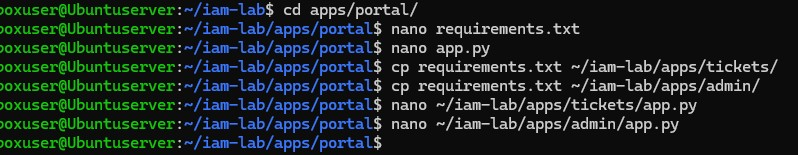
 
### 7.2 Dockerfiles y Docker Compose
 
Añadimos los Dockerfiles a cada directorio de app y los nuevos servicios al `docker-compose.yml`:
 
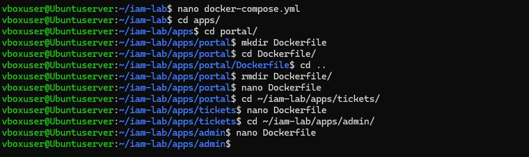
 
### 7.3 Acceso a las aplicaciones
 
Verificamos el acceso a cada aplicación:
 
**Portal del empleado** (`:5000`) — Accesible para todos los roles:
 
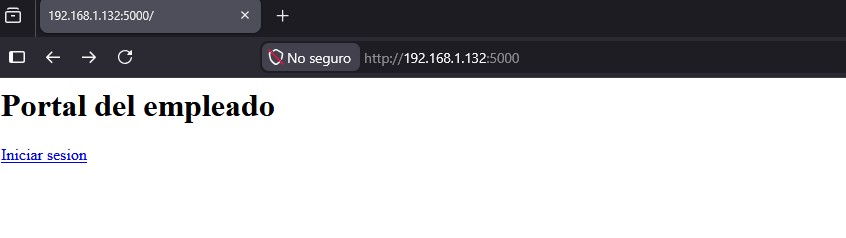
 
**Sistema de tickets** (`:5001`) — Solo para roles `soporte` y `admin`:
 
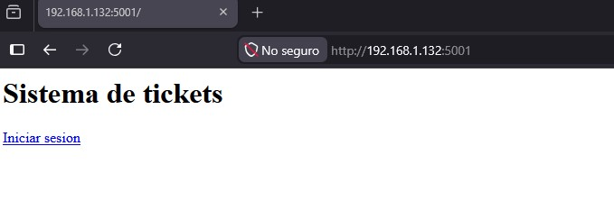
 
**Panel de administración** (`:5002`) — Solo para rol `admin`:
 
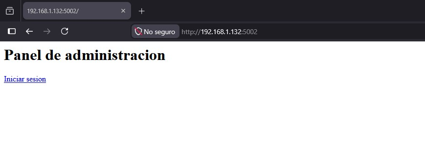
 
---
 
## 8. Verificación del RBAC
 
Verificamos que el control de acceso funciona correctamente accediendo con cada usuario a las tres aplicaciones:
 
| Usuario | Rol | Portal (:5000) | Tickets (:5001) | Admin (:5002) |
|---|---|---|---|---|
| juan | empleado | ✅ Acceso | ❌ Denegado | ❌ Denegado |
| laura | soporte | ✅ Acceso | ✅ Acceso | ❌ Denegado |
| carlos | admin | ✅ Acceso | ✅ Acceso | ✅ Acceso |
 
**Acceso exitoso con el rol correcto:**
 
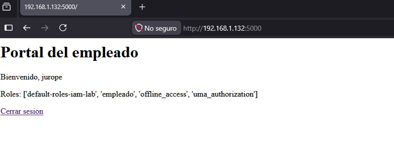
 
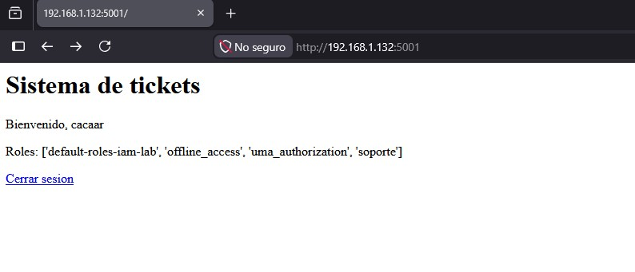
 
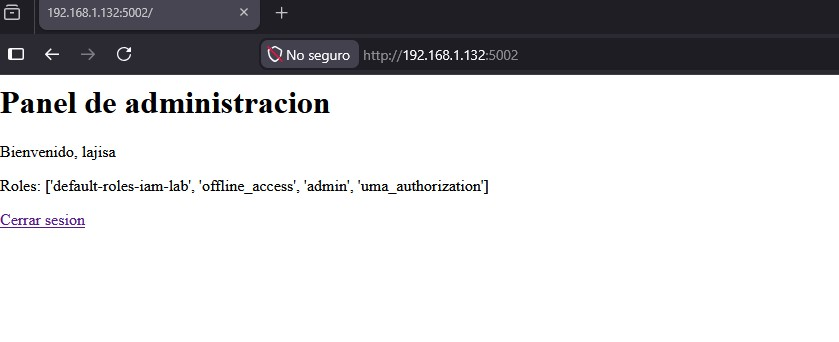
 
**Acceso denegado al intentar acceder sin el rol adecuado:**
 
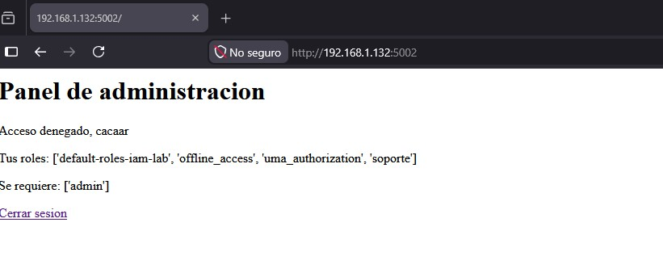
 
---
 
## 9. Autenticación multifactor (MFA/TOTP)
 
### 9.1 Activar MFA obligatorio
 
En la consola de administración de Keycloak, vamos a **Authentication** y seleccionamos el flujo **browser**:
 
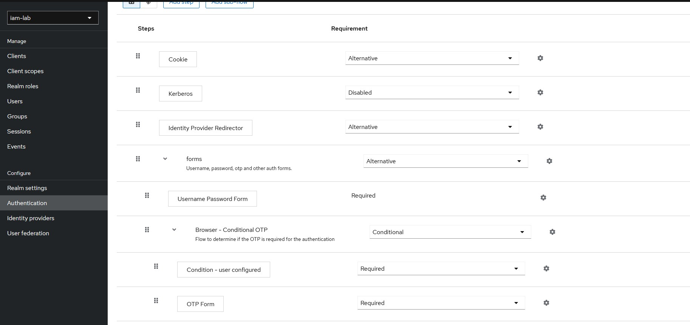
 
Cambiamos el **Conditional OTP** de `Conditional` a `Required`, lo que obliga a todos los usuarios a configurar un segundo factor:
 

 
### 9.2 Registro del dispositivo
 
Al iniciar sesión por primera vez después de activar MFA, Keycloak muestra un código QR que el usuario debe escanear con una aplicación de autenticación (Google Authenticator, Microsoft Authenticator o FreeOTP):
 
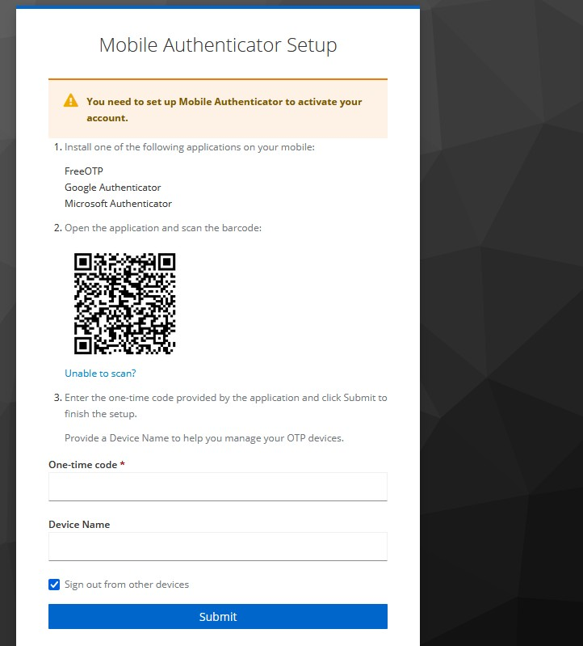
 
### 9.3 Verificación
 
Una vez configurado, cada inicio de sesión requiere dos factores: la contraseña (algo que sabes) y el código TOTP de la app (algo que tienes):
 
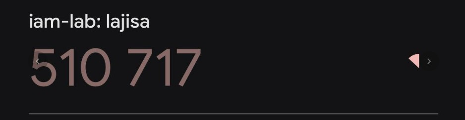
 
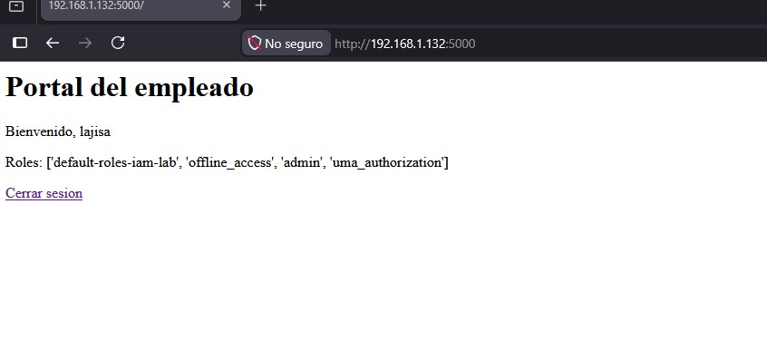
 
---
 
## 10. Federación de identidades con GitHub
 
### 10.1 Crear OAuth App en GitHub
 
Accedemos a [https://github.com/settings/developers](https://github.com/settings/developers) y creamos una nueva OAuth App con la URL de callback apuntando al endpoint de federación de Keycloak:
 
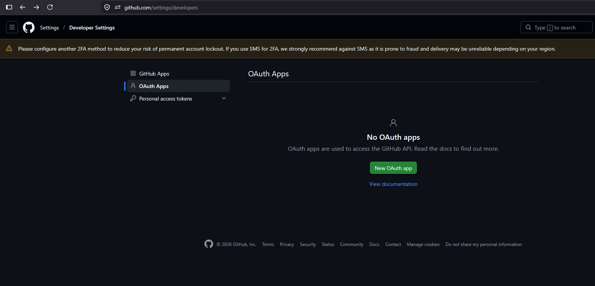
 
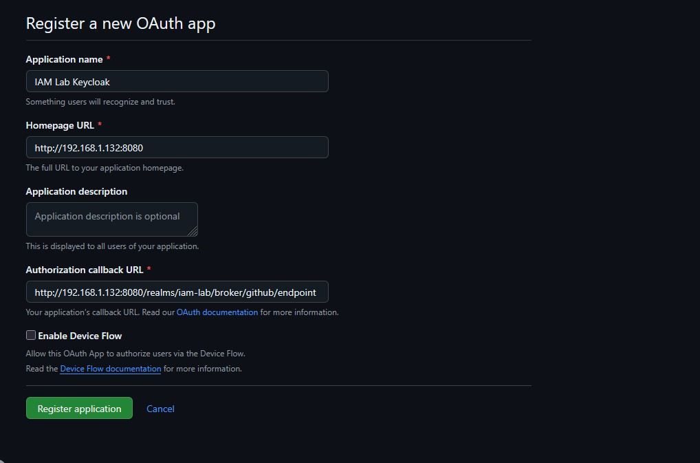
 
### 10.2 Configurar en Keycloak
 
En Keycloak, vamos a **Identity providers** > **GitHub** y pegamos el Client ID y Client Secret generados por GitHub:
 
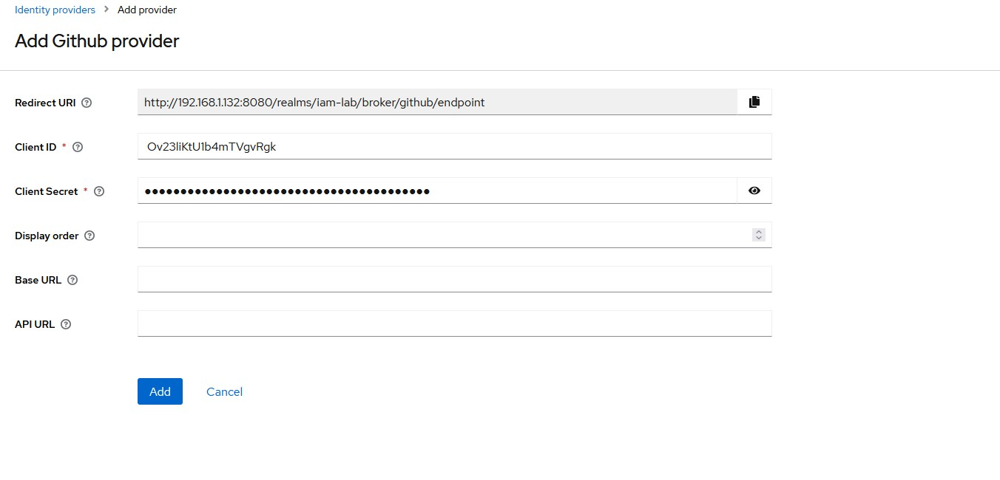
 
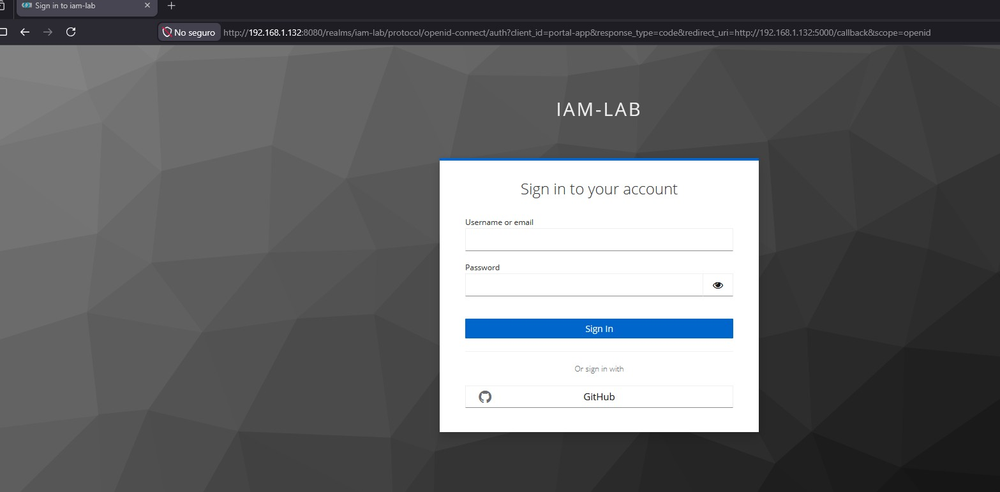
 
### 10.3 Verificación
 
Ahora la pantalla de login muestra un botón de GitHub. Los usuarios pueden autenticarse con su cuenta de GitHub como alternativa a las credenciales locales:
 
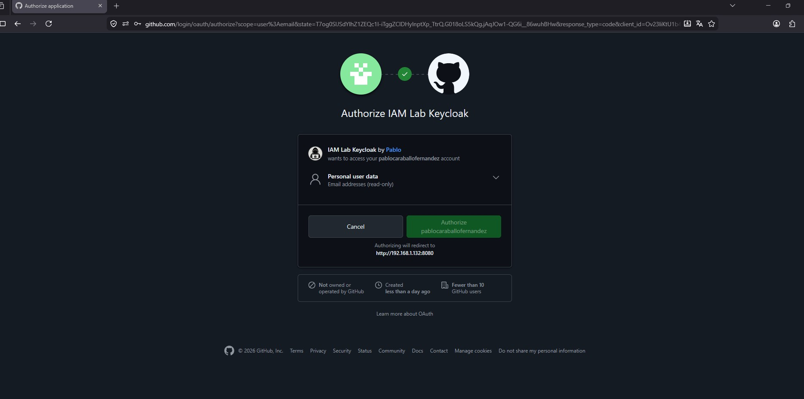
 
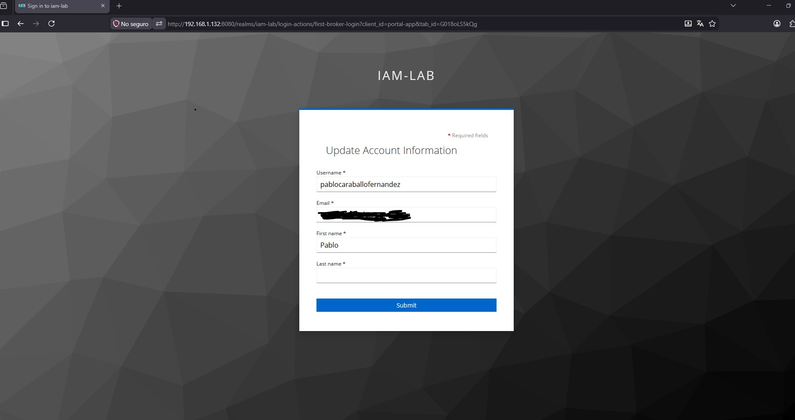
 
> Keycloak crea automáticamente una cuenta local para los usuarios que se autentican por primera vez a través de GitHub.
 
---
 
## 11. Auditoría de eventos
 
### 11.1 Activar registro de eventos
 
En Keycloak, vamos a **Realm settings** > **Events** y activamos el guardado de eventos tanto para usuarios como para acciones administrativas:
 
**Eventos de usuario** (logins, logouts, fallos de autenticación):
 
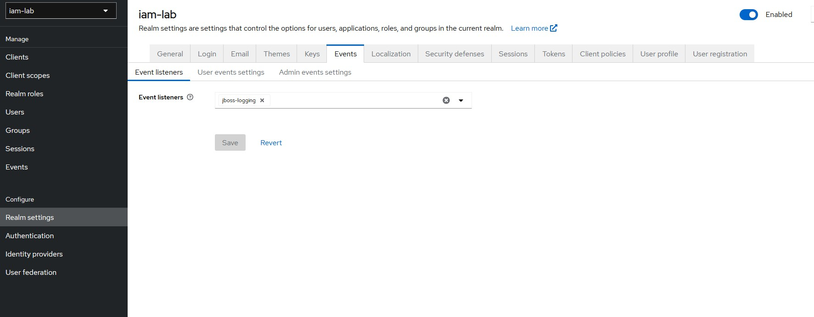
 
**Eventos administrativos** (creación de usuarios, cambios de roles, modificaciones de configuración):
 
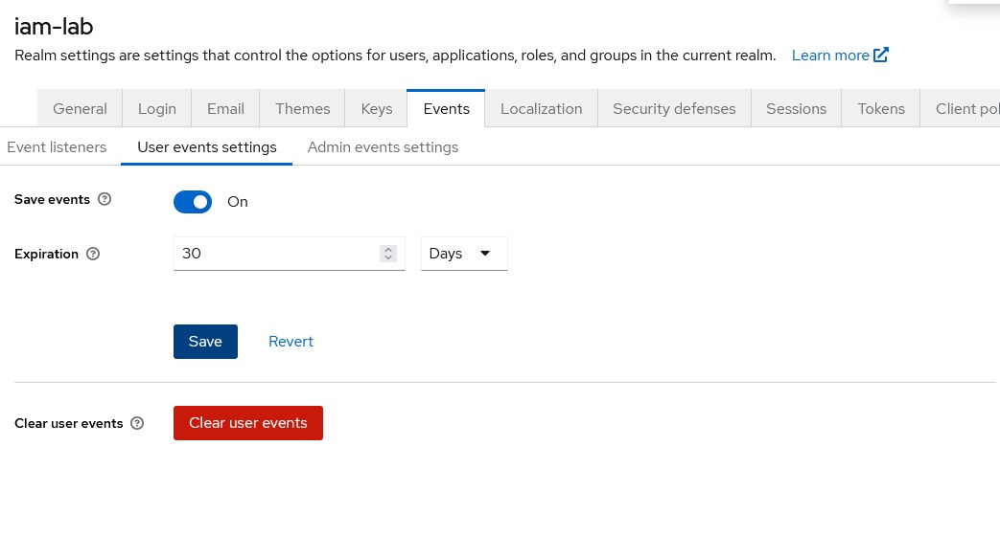
 
### 11.2 Script de auditoría
 
Para facilitar la consulta de eventos, creamos un script en Python ([`audit.py`](scripts/audit.py)) que conecta con la API REST de Keycloak y genera un informe con el resumen de eventos por tipo, logins exitosos y fallidos, y acciones administrativas:
 
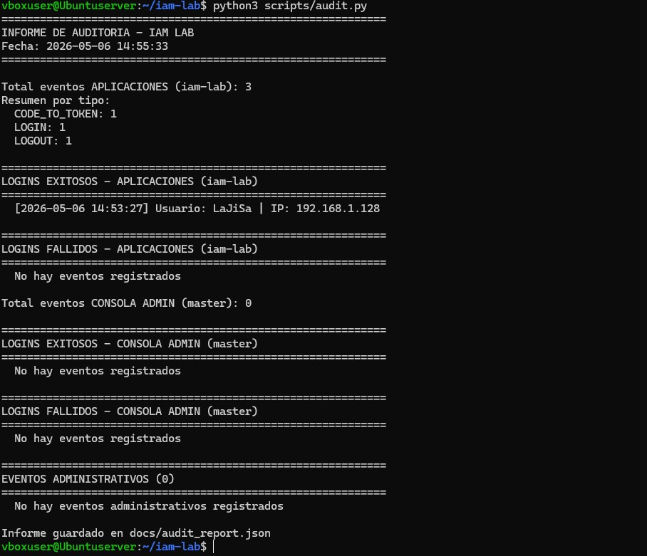
 
El script también exporta el informe completo en formato JSON para su análisis posterior.
 
---
 
## 12. Automatización de gestión de usuarios
 
### 12.1 Script de gestión
 
Creamos un script ([`user_management.py`](scripts/user_management.py)) que permite gestionar el ciclo de vida de los usuarios a través de la API REST de Keycloak:
 
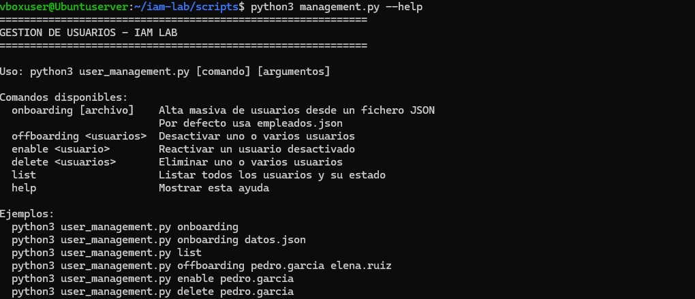
 
**Comandos disponibles:**
 
| Comando | Descripción |
|---|---|
| `onboarding` | Alta masiva de usuarios desde un fichero JSON |
| `list` | Listar todos los usuarios y su estado |
| `offboarding <usuario>` | Desactivar usuario (sin borrar datos) |
| `enable <usuario>` | Reactivar usuario desactivado |
| `delete <usuario>` | Eliminar usuario definitivamente |
 
### 12.2 Onboarding masivo
 
Creamos un archivo `empleados.json` con los datos de los nuevos usuarios y ejecutamos el onboarding. El script crea cada usuario, le asigna una contraseña temporal y el rol correspondiente a su departamento:
 
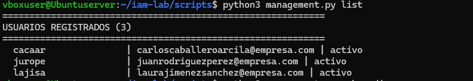
 
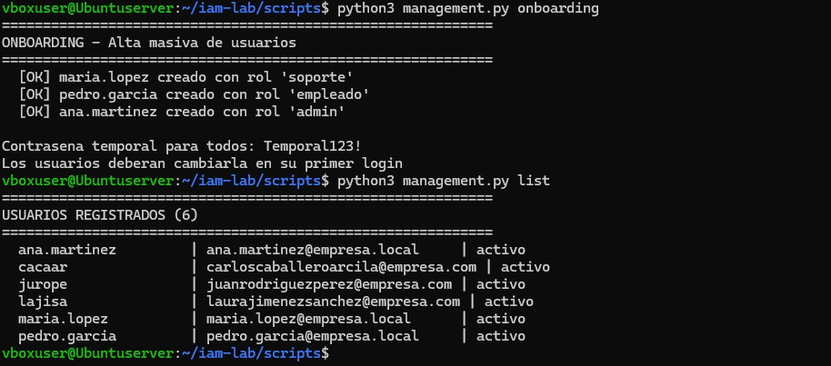
 
### 12.3 Verificación
 
Comprobamos que los usuarios se han creado correctamente:
 
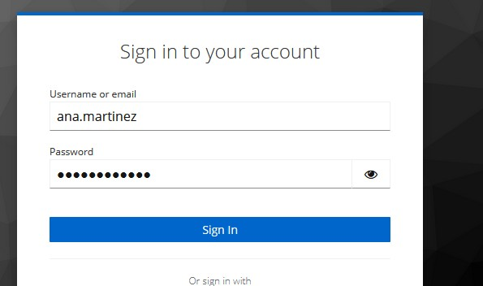
 
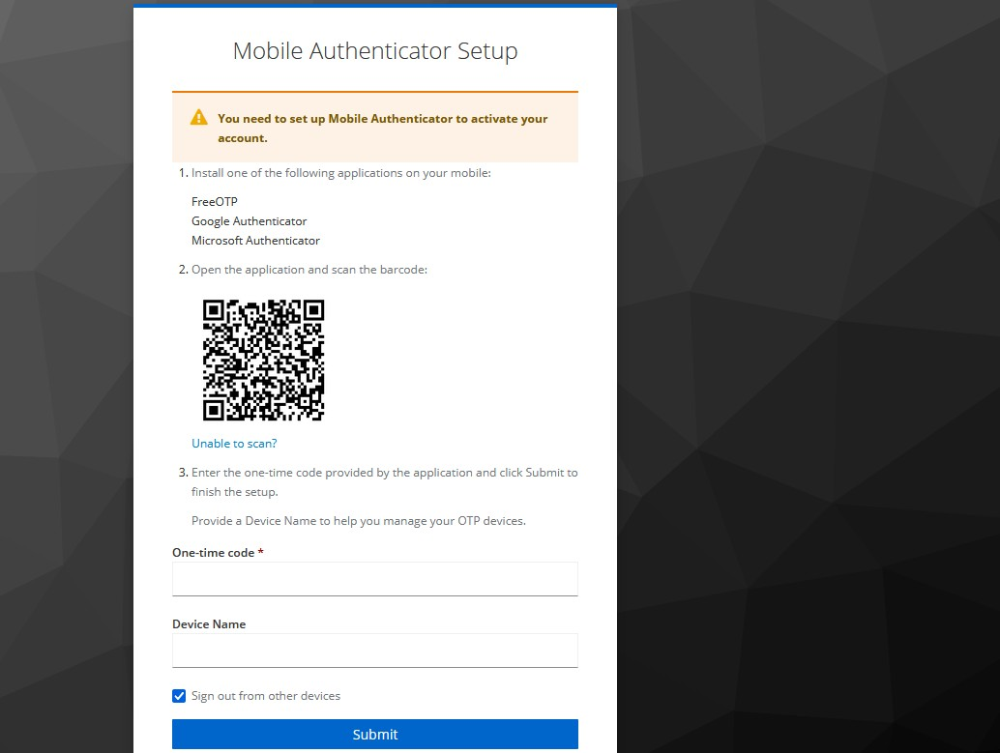
 
### 12.4 Eliminación de usuarios
 
Probamos la eliminación de un usuario:
 
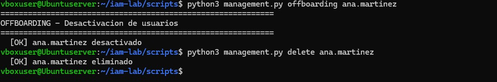
 
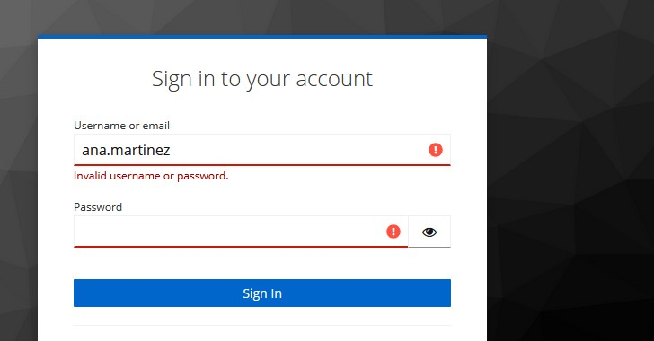
